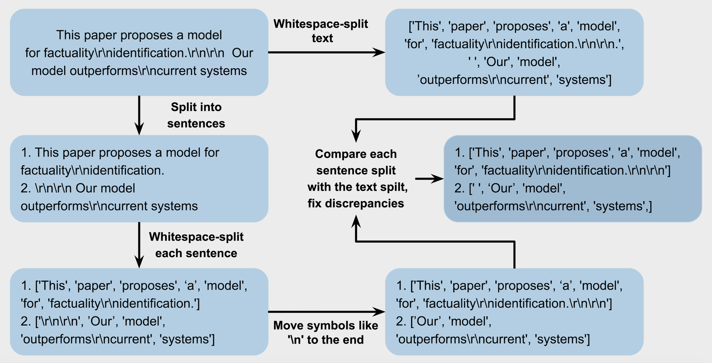

# semeval2024-machine-generated-texts-detection

This is a repository for SemEval204-Task8-subtaskC from DeepPavlov team. The repository with all information about competition: https://github.com/mbzuai-nlp/SemEval2024-task8.

Our solution recieves best MAE score in accoradance with the leaderboard.

Pipeline for Data Augmentation:

Code for augmentation can be found [here](./src/data_augmentation.py). The [baseline solution](./src/transformer_baseline.py.py) is from organizers

Files [here](./best_prediction) gives the best MAE score on test dataset (15.20903). You can use the  [scorer file from organizers](./src/data_augmentation.py) to get this result.
It didn't appear on the leaderboard, because our final submission was trained with the wrong tokenizer (it was a bug) and we obtained 18.2435 score with it. We've discovered the bug agter the submissions deadline and retrained the model with  the same pipeline and with matching tokenizer. It allowed us to improve our score and outperform the top-1 solution from the leaderboard.

We didn't use any knowledge of test data to obtain these scores.
